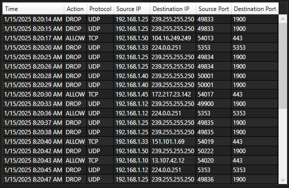

# FireLog Insight — Dokumentace (Čeština)

**Jazyk:** [English](../en/index.md) • [Русский](../ru/index.md) • [Українська](../ua/index.md)

---

## Co je FireLog Insight?
**FireLog Insight** je lehká desktopová aplikace **WPF (.NET 8)** pro parsování a vizualizaci logů **Windows Firewallu**.

- Načtěte `pfirewall.log` (nebo demo soubor v `assets/demo`).
- Filtrovat lze podle **Action** (Allow/Drop), **IP**, **Port** a **Time**.
- Řadit lze podle **Action**, **Protocol**, **IP**, **Port** a **Time**.
- Vizualizace: **Pie** (Allowed vs Blocked) a **Protocol Distribution** (sloupcový graf).
- Export filtrovaných dat do **CSV/TXT** a aktuálního grafu do **PNG**.
- Volitelný režim **PostgreSQL** (přes **Npgsql**) s „Remember me“.
- **Offline režim**, pokud DB není nakonfigurována.
- Strukturované logování přes **Serilog** (soubor + debug sink).


---


## Rychlý start
1) **Získejte build**
   
• Portable release: [stáhnout poslední verzi](https://github.com/Rincodev/FireLog-Insight/releases/latest) a rozbalit.  

• Ze zdrojových kódů:
```bash
dotnet restore
dotnet build -c Release
```

2) **(Volitelné) Nastavte databázi** — viz **[Konfigurace](#konfigurace)**.

> [!CAUTION]
> Pokud krok přeskočíte, aplikace poběží v **Offline režimu**.

3) **Spusťte aplikaci**  
• Portable: spusťte `Start FireLog.cmd` (knihovny DLL zůstanou v adresáři `app/`).  
• Nebo spusťte přímo `FireLog.exe`.

4) **Hotovo — načtěte logy a užijte si FireLog Insight!**

> [!IMPORTANT]
> Pokud jste logování Windows Firewallu právě zapnuli, nové záznamy se nemusejí objevit hned.
> Nechte systém pár minut běžně komunikovat po síti (případně restartujte počítač) a zkuste log načíst znovu.


---


## Konfigurace
> [!TIP]
> **Nikdy** necommituje reálné přihlašovací údaje.
> Preferujte **proměnné prostředí**.
>
> **Proměnné prostředí nejsou soubory** — nastavují se v OS nebo ve spouštěcím skriptu.
>
> **Portable build:** upravte `Start FireLog.cmd`, aby proměnné prostředí nastavil před spuštěním aplikace.
>
> **NEBO**
>
> umístěte `db_credentials.json` vedle `FireLog.exe` do složky `app/`.
>
> Lokální `db_credentials.json` vedle spustitelného souboru je podporován jako fallback.

### Proměnné prostředí (doporučeno pro CI/ops)
- Nastavte je na úrovni uživatele / počítače ve Windows **nebo** je přidejte do spouštěče:
```bat
@echo off
set APP_DB_HOST=your-host
set APP_DB_PORT=5432
set APP_DB_USER=firelog_app
set APP_DB_PASSWORD=***secret***
set APP_DB_NAME=firelog
set APP_DB_SSLMODE=Require
start "" "FireLog.exe"
```

### Lokální soubor (fallback, netrackuje se)
- Umístěte `db_credentials.json` vedle `FireLog.exe` (portable: `app\db_credentials.json`).
```json
{
  "Host": "aws-0-eu-central-1.pooler.supabase.com",
  "Port": 5432,
  "User": "postgres.<instance-id>",
  "Password": "<SET_VIA_ENV_OR_LOCAL_FILE>",
  "Database": "postgres",
  "SslMode": "Require"
}
```

### Connection string (Npgsql)
```
Host={Host};Port={Port};Username={User};Password={Password};Database={Database};
SslMode={SslMode};Timeout=15;Command Timeout=30;Keepalive=60
```

> [!CAUTION]
> Desktopové aplikace nedokážou tajnosti dokonale skrýt. Používejte role s minimálními právy a pravidelně měňte hesla.

### Remember me
- Po zaškrtnutí aplikace vytvoří per‑user `remember_token` v DB a uloží lokální `credentials.json` vedle spustitelného souboru.  
- Při **Logout** se token v DB smaže a lokální soubor se odstraní.


---


## Uživatelské rozhraní
(Screenshot gallery: `docs/screenshots/`)

<p align="center">
  
</p>


### Rychlá navigace: [Horní lišta](#ui-top) • [Pravý panel](#ui-right) • [Security Alerts](#ui-alerts) • [Spodní lišta](#ui-bottom) • [Tabulka](#ui-table)

<a id="ui-top"></a>
### Horní lišta
<p>
  
</p>

- **Filtry** — časové rozmezí, Action (All/Allow/Drop), IP(src/dest), Port(src/dest).
- **Data Source** — *Local* vs *Database*. Pokud DB není dostupná/platná, aplikace přepne na *Local* a jednou zobrazí tip.
- **Apply Filters / Reset Filters** — spustí / vyčistí filtry.
- **Logout** — odhlášení z DB (okno nahoře zobrazuje aktuálního uživatele).


   ---

  
<a id="ui-right"></a>
### Pravý panel
<p>
  
</p>

- **Stats & Charts** — sumarizace a přepínač grafů (Pie / Protocol Distribution).
- **Enable Logs** — zapnutí systémového logování (pokud je dostupné).
- **Extract Data** — vytažení logů z lokálního souboru nebo z DB (bez speciální transformace).
- **Upload to DB** — nahrání vybraných záznamů do databáze.

> [!WARNING]
> Všechny grafy se počítají z **aktuálně filtrovaných** záznamů.


  ---

  
<a id="ui-alerts"></a>
### Security Alerts
<p>
  
</p>

- **Security Alerts** — panel pro upozornění na podezřelé aktivity.


   ---

  
<a id="ui-bottom"></a>
### Spodní lišta
<p>
  
</p>

- **Load demo data** — načte ukázkové logy.
- **Export reports (CSV/TXT)** — exportuje **filtrovanou tabulku**.
- **Export chart (PNG)** — uloží aktuálně zobrazený graf jako obrázek.


  ---

  
<a id="ui-table"></a>
### Tabulka
<p>
  
</p>

- Sloupce: Timestamp, Action, Protocol, Source IP/Port, Destination IP/Port, User ID.
- Zobrazené řádky vždy odpovídají aktivním filtrům.

> [!TIP]
> Kliknutím na hlavičku sloupce zapnete **řazení** vzestupně/sestupně (např. podle Protocol, Time, Port, IP).
> 
> **Šířku sloupců** změníte tažením okrajů hlaviček (podobně jako v Excelu).
> 
> Dvojklik na okraj může šířku auto‑přizpůsobit (pokud to dovolí vaše téma systému).


---


## Demo data
- Ukázkový log firewallu: `assets/demo/pfirewall_demo.log`.
- V aplikaci je můžete načíst tlačítkem **Load Demo** a ověřit parsování, filtry a grafy bez práce s reálnými logy.

---

## Logování (Serilog)
- Logy se zapisují do `logs/firelog-.log` (denní rotace, UTF‑8) a do Debug sinku během vývoje.
- Konfigurace při startu je v `App.xaml.cs`:

```csharp
Log.Logger = new LoggerConfiguration()
    .MinimumLevel.Information()
    .Enrich.FromLogContext()
    .WriteTo.Debug()
    .WriteTo.File(
        path: Path.Combine(AppDomain.CurrentDomain.BaseDirectory, "logs", "firelog-.log"),
        rollingInterval: RollingInterval.Day,
        retainedFileCountLimit: 7,
        encoding: Encoding.UTF8)
    .CreateLogger();
```

---

## FAQ
**Je DB povinná?**  
Ne. Bez konfigurace DB aplikace běží v **Offline** režimu.

**Kde se berou přihlašovací údaje?**  
Z **proměnných prostředí** nebo z lokálního `db_credentials.json`. „Remember me“ ukládá lokální `credentials.json` a token v DB; oba se smažou při **Logout**.

**Proč se režim Database vrací na Local?**  
Když chybí/je neplatná DB konfigurace, aplikace zobrazí tip a přepne na **Local**.

**Jaká DB je podporována?**  
**PostgreSQL** přes **Npgsql**. Očekávaná tabulka `users` obsahuje `id`, `username`, `password_hash`, `remember_token`.

---

## Tým & přispěvatelé
**Bohdan ——> @Rincodev**  
Teamlead, development & release; architektura & bezpečnost; DB connect/config; DB extract & export; integrace & merge; napojení UI (akce/handlery); grafy; exporty; stabilizace & testy.

**Štefan ——> @Just-Kurumi**  
UI/UX; XAML layouty & vizuální téma; navigace/menu; tabulky/gridy.

**Hanuš ——> @Menk1l**  
Architektura & integrace data↔UI; filtrování/vyhledávání; PowerShell; lokální zpracování logů; Security Alerts UI; parser logů Windows Firewallu; testování.

**Lukáš ——> @Tykanek**  
UI/UX; autentizace (Login/Logout); propojování ovládacích prvků s logikou; IP/časové filtry; testování.

Přispěvatelé: @Menk1l (Hanuš Hart) • @Tykanek (Lukáš Elbl) • @Rincodev (Rincodev) • @Just-Kurumi (Kurumi)

---

## Licence
Licencováno pod MIT — viz [LICENSE](../../LICENSE)

MIT © 2025 Rincodev (GitHub: @Rincodev, kontakt: jacenbo1226@gmail.com)
