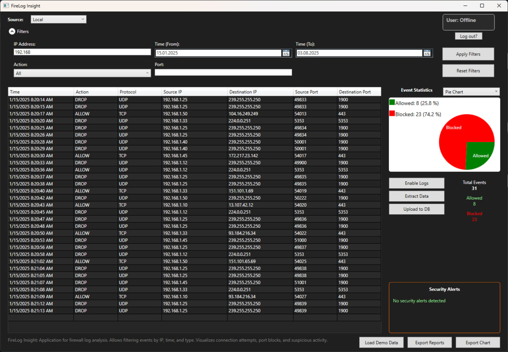
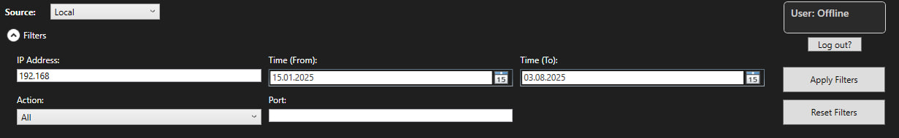
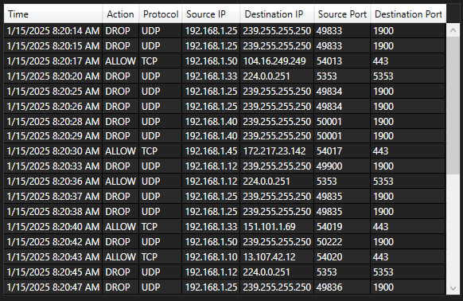
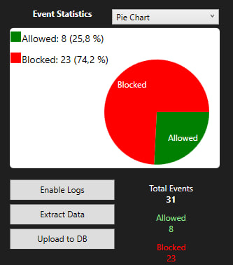
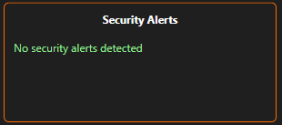
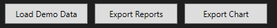

# FireLog Insight — Documentation (EN)

**Language:** [Čeština](../cs/index.md) • [Русский](../ru/index.md) • [Українська](../ua/index.md)

---

## What is FireLog Insight?
**FireLog Insight** is a lightweight **WPF (.NET 8)** desktop tool for parsing and visualizing **Windows Firewall** logs.

- Load `pfirewall.log` (or the sample in `assets/demo`).
- Filter by **Action** (Allow/Drop), **IP**, **Port**, and **Time**.
- Sort by **Action** (Allow/Drop), **Protocol**, **IP**, **Port**, and **Time**.
- Visualize with **Pie** (Allowed vs Blocked) and **Protocol Distribution** (bar).
- Export filtered data to **CSV** and the current chart to **PNG**.
- Optional **PostgreSQL** mode (via **Npgsql**) with "Remember me".
- **Offline mode** when no DB is configured.
- Structured logging via **Serilog** (file + debug sinks).


---


## Quick start
1) **Get a build**
   
• Portable release: [Download the latest build](https://github.com/Rincodev/FireLog-Insight/releases/latest) and unzip.

• From source:
```bash
 dotnet restore
 dotnet build -c Release
```

2) **(Optional) Configure database** — see **[Configuration](#configuration)**.

> [!CAUTION]
> If you skip this, the app starts in **Offline mode**.

3) **Run the app**  
• Portable: run `Start FireLog.cmd` (keeps DLLs inside the `app/` folder).  
• Or run `FireLog.exe` directly.

4) **You’re ready to go — load your logs and enjoy FireLog Insight!**

>[!IMPORTANT]
>If you’ve just enabled Windows Firewall logging, new entries may not appear immediately. Give it a few minutes of normal network activity (or restart the machine) and then try loading the log again.


---


## Configuration
> [!TIP]
> Do **not** commit real credentials.
> Prefer **environment variables**.
>
> 
> **Environment variables are not files** — they must be set in the OS or in your launcher script.
>
> 
> **Portable build:** edit `Start FireLog.cmd` to set environment variables before launching the app.
>
> **OR**
>
> place `db_credentials.json` next to `FireLog.exe` in the `app/` folder
>
> 
> A local `db_credentials.json` next to the executable is supported as a fallback.

### Environment variables (recommended for CI/ops)
- Set them at the user/machine level in Windows, **or** edit the launcher:
  ```bat
  @echo off
  set APP_DB_HOST=your-host
  set APP_DB_PORT=5432
  set APP_DB_USER=firelog_app
  set APP_DB_PASSWORD=***secret***
  set APP_DB_NAME=firelog
  set APP_DB_SSLMODE=Require
  start "" "FireLog.exe"

### Local file (fallback, not tracked): 
- Put `db_credentials.json` next to `FireLog.exe` (portable: `app\db_credentials.json`).
```json
{
  "Host": "aws-0-eu-central-1.pooler.supabase.com",
  "Port": 5432,
  "User": "postgres.<instance-id>",
  "Password": "<SET_VIA_ENV_OR_LOCAL_FILE>",
  "Database": "postgres",
  "SslMode": "Require"
}
```

### Connection string (Npgsql)
```
Host={Host};Port={Port};Username={User};Password={Password};Database={Database};
SslMode={SslMode};Timeout=15;Command Timeout=30;Keepalive=60
```

> [!CAUTION]
> Desktop apps cannot fully hide secrets. Use least‑privilege roles and rotate passwords if they might be exposed.

### Remember me
- When checked, the app creates a per‑user `remember_token` in the DB and writes a local `credentials.json` next to the executable.  
- On **Logout**, the token is cleared from DB and the local file is deleted.

---

## User interface guide
(Screenshot gallery: `docs/screenshots/`)

<p align="center">
  
</p>


### Quick navigation [Top area](#ui-top) • [Table](#ui-table) • [Right panel (stats & charts)](#ui-right) • [Security Alerts](#ui-alerts) • [Bottom actions](#ui-bottom)

---

<a id="ui-top"></a>
### Top area — Filters & session
<p>
  
</p>

- **Filters**
  - **Time range** — *From* / *To*.
  - **Action** — *All* / *Allow* / *Drop* (also matches “Block”).
  - **IP contains** — substring match against **Source IP** and **Destination IP**.
  - **Port contains** — substring match against **Source Port** and **Destination Port**.
  - **Apply Filters** / **Reset Filters** — apply or clear the filter set.

- **Data Source** — *Local* or *Database*.  
  If DB isn’t configured/available, the app stays in **Local** (you’ll see a small tip once).

- **User box + Logout**
  - The user box shows the current identity (e.g., **User: Offline** or the logged-in username).
  - **Logout** clears the active session; there is **no “Login” button** in this view.

> [!NOTE]
> Protocol isn’t a filter here — use **table sorting by the Protocol column** (see below).

---

<a id="ui-table"></a>
### Table — Events list (center)
<p>
  
</p>

- Columns: **Time**, **Action**, **Protocol**, **Source IP/Port**, **Destination IP/Port**, **User ID**.
- The table always reflects the **active filters**.

> [!TIP]
> Click any column header to **sort** ascending/descending (e.g., by **Protocol**, **Time**, **Port**, **IP**).  
> **Resize columns** by dragging header borders (Excel-style).  
> Double-click a header border to auto-fit width (if supported by your system theme).

---

<a id="ui-right"></a>
### Right panel — Stats & charts
<p>
  
</p>

- **Chart selector** — `Pie Chart` / `Protocol Distribution`.  
- **Pie** — Allowed vs Blocked.  
- **Protocol Distribution** — bar chart of protocol counts.  
- **Totals** — quick counters for **Total**, **Allowed**, **Blocked**.  

**Actions**
- **Enable Logs** — helper to enable Windows Firewall logging (when available).
- **Extract Data** — pulls logs from the **current source** (*Local* or *Database*).
- **Upload to DB** — uploads the **currently loaded entries** to the configured PostgreSQL database.

> [!IMPORTANT]
> Charts and totals are calculated from the **currently filtered** set of entries.

---

<a id="ui-alerts"></a>
### Security Alerts — right-bottom
<p>
  
</p>

- Heuristics that flag things like **Suspicious ports** and **Unusual outgoing traffic**.  
- Use them as pointers for manual review; they’re not a replacement for IDS/IPS.

---

<a id="ui-bottom"></a>
### Bottom actions — center-right
<p>
  
</p>

- **Load Demo Data** — loads `assets/demo/pfirewall_demo.log` with one click (handy to verify parsing/filters/charts).
- **Export Reports** — exports the filtered table as **CSV** and **TXT**.
- **Export Chart** — saves the **current chart** as a **PNG** image.


---

## Logging (Serilog)
- Logs go to `logs/firelog-.log` (rolling daily, UTF‑8) and to the Debug sink during development.
- Startup configuration lives in `App.xaml.cs`:

```csharp
Log.Logger = new LoggerConfiguration()
    .MinimumLevel.Information()
    .Enrich.FromLogContext()
    .WriteTo.Debug()
    .WriteTo.File(
        path: Path.Combine(AppDomain.CurrentDomain.BaseDirectory, "logs", "firelog-.log"),
        rollingInterval: RollingInterval.Day,
        retainedFileCountLimit: 7,
        encoding: Encoding.UTF8)
    .CreateLogger();
```

---


## FAQ
**Is DB required?**  
No. Without DB config the app runs in **Offline** mode.

**Where are credentials stored?**  
From **env vars** or local `db_credentials.json`. "Remember me" writes a local `credentials.json` and a token in the DB; both are cleared on **Logout**.

**Why does Database mode revert to Local?**  
If DB config is missing or invalid, the app shows a tip and reverts to **Local**.

**Which DB is supported?**  
**PostgreSQL** via **Npgsql**. The expected `users` table contains `id`, `username`, `password_hash`, `remember_token`.


---


## Team & Contributors 

**Bohdan ——> @Rincodev** 

Teamlead, development & release; architecture & security; DB connect/config; DB extract & export; integration & code merging; UI wiring (actions/handlers); charts; exports; stabilization & tests. 

**Štefan ——> @Just-Kurumi** 

UI/UX; XAML layouts & visual theme; navigation/menus; tables/grids. 

**Hanuš ——> @Menk1l** 

Architecture & data↔UI integration; filtering/search; PowerShell integration; local log processing; Security Alerts UI; Windows Firewall log parser; testing. 

**Lukáš ——> @Tykanek** 

UI/UX; Authentication (Login/Logout); control→logic wiring; IP/time filters; testing. 

Contributors: @Menk1l (Hanuš Hart) • @Tykanek (Lukáš Elbl) • @Rincodev (Rincodev) • @Just-Kurumi (Kurumi)


---


## License 
Licensed under MIT — see [LICENSE](../../LICENSE)

MIT © 2025 Rincodev (GitHub: @Rincodev, contact: jacenbo1226@gmail.com)
