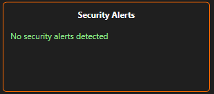
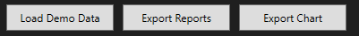

# FireLog Insight — Документация (RU)

**Язык:** [Čeština](../cs/index.md) • [English](../en/index.md) • [Українська](../ua/index.md)

---

## Что такое FireLog Insight?
**FireLog Insight** — лёгкое **WPF (.NET 8)** десктоп-приложение для парсинга и визуализации логов **Брандмауэра Windows**.

- Загружает `pfirewall.log` (или образец в `assets/demo`).
- Фильтрация по **Action** (Allow/Drop), **IP**, **Port** и **Time**.
- Сортировка по **Action** (Allow/Drop), **Protocol**, **IP**, **Port** и **Time**.
- Визуализация: **Pie** (Allowed vs Blocked) и **Protocol Distribution** (столбчатая).
- Экспорт отфильтрованных данных в **CSV** и текущей диаграммы в **PNG**.
- Необязательный режим **PostgreSQL** (через **Npgsql**) с "Remember me".
- **Офлайн-режим**, если БД не настроена.
- Структурированное логирование через **Serilog** (файл + Debug).

---

## Быстрый старт
1) **Получить сборку**
   
• Портативный релиз: [Download the latest build](https://github.com/Rincodev/FireLog-Insight/releases/latest) и распакуйте.

• Из исходников:
```bash
 dotnet restore
 dotnet build -c Release
```

2) **(Необязательно) Настроить базу данных** — см. **[Configuration](#configuration)**.

> [!CAUTION]
> Если пропустить этот шаг, приложение запустится в **офлайн-режиме**.

3) **Запуск приложения**  
• Портативная сборка: запустите `Start FireLog.cmd` (оставляет DLL в папке `app/`).  
• Либо запустите `FireLog.exe` напрямую.

4) **Готово — загружайте логи и пользуйтесь FireLog Insight!**

> [!IMPORTANT]
> Если вы только что включили логирование Брандмауэра Windows, новые записи могут появиться не сразу. Дайте системе несколько минут обычной сетевой активности (или перезагрузите компьютер), затем попробуйте загрузить лог снова.

---

## Configuration
> [!TIP]
> **Не** коммитьте реальные учётные данные.
> Предпочитайте **переменные окружения**.
>
> **Переменные окружения — не файлы**: их нужно задавать в ОС или в запускном скрипте.
>
> **Портативная сборка:** отредактируйте `Start FireLog.cmd`, чтобы задать переменные окружения перед запуском приложения.
>
> **ИЛИ**
>
> положите `db_credentials.json` рядом с `FireLog.exe` в папку `app/`
>
> Локальный `db_credentials.json` рядом с исполняемым файлом поддерживается как запасной вариант.

### Переменные окружения (рекомендуется для CI/ops)
- Задайте их на уровне пользователя/машины в Windows **или** отредактируйте запускной скрипт:
  ```bat
  @echo off
  set APP_DB_HOST=your-host
  set APP_DB_PORT=5432
  set APP_DB_USER=firelog_app
  set APP_DB_PASSWORD=***secret***
  set APP_DB_NAME=firelog
  set APP_DB_SSLMODE=Require
  start "" "FireLog.exe"
  ```

### Локальный файл (fallback, не отслеживается):
- Поместите `db_credentials.json` рядом с `FireLog.exe` (портативная: `app\db_credentials.json`).

```json
{
  "Host": "aws-0-eu-central-1.pooler.supabase.com",
  "Port": 5432,
  "User": "postgres.<instance-id>",
  "Password": "<SET_VIA_ENV_OR_LOCAL_FILE>",
  "Database": "postgres",
  "SslMode": "Require"
}
```

### Строка подключения (Npgsql)
```
Host={Host};Port={Port};Username={User};Password={Password};Database={Database};
SslMode={SslMode};Timeout=15;Command Timeout=30;Keepalive=60
```

> [!CAUTION]
> Десктоп-приложения не могут полностью скрыть секреты. Используйте роли с наименьшими привилегиями и ротируйте пароли при возможной утечке.

### Remember me
- При включении создаётся пользовательский `remember_token` в БД и локальный `credentials.json` рядом с исполняемым файлом.  
- При **Logout** токен в БД очищается, локальный файл удаляется.

---

## Руководство по интерфейсу
(Галерея скриншотов: `docs/screenshots/`)

<p align="center">
  
</p>

### Быстрая навигация [Верхняя область](#ui-top) • [Таблица](#ui-table) • [Правая панель (статистика и графики)](#ui-right) • [Security Alerts](#ui-alerts) • [Нижние действия](#ui-bottom)

---

<a id="ui-top"></a>
### Верхняя область — фильтры и сессия
<p>
  
</p>

- **Filters**
  - **Time range** — *From* / *To*.
  - **Action** — *All* / *Allow* / *Drop* (также сопоставляется “Block”).
  - **IP contains** — подстрочный поиск по **Source IP** и **Destination IP**.
  - **Port contains** — подстрочный поиск по **Source Port** и **Destination Port**.
  - **Apply Filters** / **Reset Filters** — применить или сбросить набор фильтров.

- **Data Source** — *Local* или *Database*.  
  Если БД не настроена/недоступна, приложение остаётся в **Local** (один раз будет показана небольшая подсказка).

- **User box + Logout**
  - В блоке пользователя отображается текущая идентичность (например, **User: Offline** или имя вошедшего пользователя).
  - **Logout** очищает активную сессию; **кнопки “Login” здесь нет**.

---

<a id="ui-table"></a>
### Таблица — список событий (центр)
<p>
  
</p>

- Столбцы: **Time**, **Action**, **Protocol**, **Source IP/Port**, **Destination IP/Port**.
- Таблица всегда отражает **активные фильтры**.

> [!TIP]
> Клик по заголовку столбца — **сортировка** по возрастанию/убыванию (например, по **Protocol**, **Time**, **Port**, **IP**).
> 
> **Меняйте ширину** столбцов перетаскиванием границ заголовков (как в Excel).
> 
> Двойной клик по границе заголовка — авто-подбор ширины (если поддерживается темой ОС).

---

<a id="ui-right"></a>
### Правая панель (статистика и графики)
<p>
  
</p>

- **Chart selector** — `Pie Chart` / `Protocol Distribution`.  
- **Pie** — Allowed vs Blocked.  
- **Protocol Distribution** — столбчатая диаграмма распределения протоколов.  
- **Totals** — быстрые счётчики **Total**, **Allowed**, **Blocked**.  

**Actions**
- **Enable Logs** — помощник для включения логирования Брандмауэра Windows (если доступно).
- **Extract Data** — извлекает логи из **текущего источника** (*Local* или *Database*).
- **Upload to DB** — отправляет **текущие загруженные записи** в настроенную БД PostgreSQL.

> [!IMPORTANT]
> Диаграммы и счётчики считаются из **текущего отфильтрованного** набора записей.

---

<a id="ui-alerts"></a>
### Security Alerts
<p>
  
</p>

- Эвристики, подсвечивающие **подозрительные порты** и **нетипичный исходящий трафик**.  
- Используйте как ориентиры для ручной проверки; это не замена IDS/IPS.

---

<a id="ui-bottom"></a>
### Нижние действия
<p>
  
</p>

- **Load Demo Data** — загружает `assets/demo/pfirewall_demo.log` одним кликом (удобно для проверки парсинга/фильтров/графиков).
- **Export Reports** — экспорт таблицы с учётом фильтров в **CSV** и **TXT**.
- **Export Chart** — сохраняет **текущую диаграмму** как **PNG**.

---

## Логирование (Serilog)
- Логи пишутся в `logs/firelog-.log` (ежедневное вращение, UTF-8) и в Debug-sink во время разработки.
- Конфигурация старта находится в `App.xaml.cs`:

```csharp
Log.Logger = new LoggerConfiguration()
    .MinimumLevel.Information()
    .Enrich.FromLogContext()
    .WriteTo.Debug()
    .WriteTo.File(
        path: Path.Combine(AppDomain.CurrentDomain.BaseDirectory, "logs", "firelog-.log"),
        rollingInterval: RollingInterval.Day,
        retainedFileCountLimit: 7,
        encoding: Encoding.UTF8)
    .CreateLogger();
```

---

## FAQ
**Требуется ли БД?**  
Нет. Без настройки БД приложение работает в **офлайн-режиме**.

**Где хранятся учётные данные?**  
Из **переменных окружения** или локального `db_credentials.json`. При "Remember me" создаётся локальный `credentials.json` и токен в БД; оба очищаются при **Logout**.

**Почему режим Database возвращается в Local?**  
Если конфигурация БД отсутствует или неверна, приложение показывает подсказку и возвращается в **Local**.

**Какая БД поддерживается?**  
**PostgreSQL** через **Npgsql**. Ожидается таблица `users` с полями `id`, `username`, `password_hash`, `remember_token`.

---

## Команда и участники

**Bohdan ——> @Rincodev** 

Тимлид, разработка и релиз; архитектура и безопасность; подключение/конфиг БД; извлечение/экспорт в БД; интеграция и слияние кода; связка UI (действия/обработчики); диаграммы; экспорты; стабилизация и тесты. 

**Štefan ——> @Just-Kurumi** 

UI/UX; XAML-макеты и визуальная тема; навигация/меню; таблицы/сетки. 

**Hanuš ——> @Menk1l** 

Архитектура и интеграция данные↔UI; фильтрация/поиск; интеграция PowerShell; локальная обработка логов; UI Security Alerts; парсер логов Брандмауэра Windows; тестирование. 

**Lukáš ——> @Tykanek** 

UI/UX; Аутентификация (Login/Logout); связка контролов с логикой; фильтры IP/времени; тестирование. 

Участники: @Menk1l (Hanuš Hart) • @Tykanek (Lukáš Elbl) • @Rincodev (Rincodev) • @Just-Kurumi (Kurumi)

---

## Лицензия 
Лицензия MIT — см. [LICENSE](../../LICENSE)

MIT © 2025 Rincodev (GitHub: @Rincodev, contact: jacenbo1226@gmail.com)
